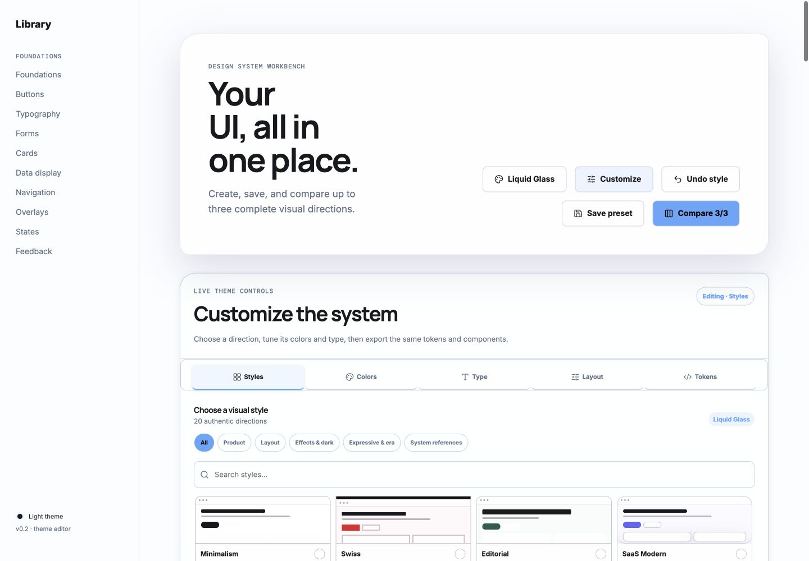
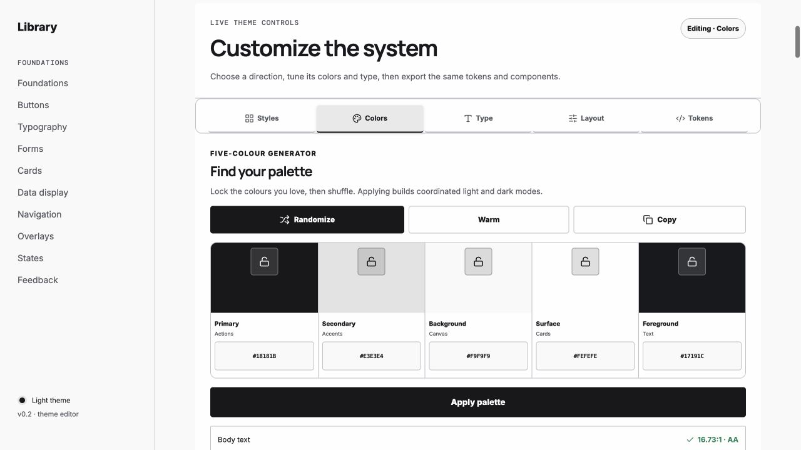

# UI Made Easy

Explore 20 authentic visual systems, tune every semantic token across a full component inventory, compare complete directions, and export a runnable Tailwind/shadcn-compatible starter.

[](https://react.dev/)
[](https://www.typescriptlang.org/)
[](https://vite.dev/)
[](LICENSE)



UI Made Easy is a desktop-first design-system workbench. It puts buttons, typography, forms, cards, tables, navigation, overlays, loading states, feedback, and other common UI primitives on one page, so every design decision is tested against a real system instead of a single marketing card.

## How it works

1. **Choose a direction.** Start from one of 20 curated visual systems rather than a blank canvas.
2. **Tune the whole system.** Edit colors, heading/body/mono fonts, spacing, density, radius, borders, shadows, and motion from the inline editor.
3. **Review every component.** The same semantic tokens flow through the complete component inventory, structural demos, overlays, and loading states.
4. **Save and compare.** Name a preset and compare up to three directions side by side before committing to one.
5. **Export a foundation.** Download a runnable Vite + React + Tailwind CSS v4 starter with local shadcn-style primitives and the selected recipe.

## Tune a coordinated palette

The five-color generator works like a compact palette lab: lock colors you want to keep, randomize the rest, edit any hex value, inspect contrast, and apply the result across coordinated light and dark tokens.



## What is included

- A full 80/20 component inventory with practical variants and states.
- 20 curated styles across product, layout, effects, expressive, and design-system-inspired categories.
- Five-color palette generation with locks, editable hex values, contrast feedback, warm examples, and one-click application.
- Heading, body, and monospace font roles with type-scale controls.
- Global spacing, density, radius, border, elevation, blur, texture, and motion controls.
- Six loading treatments: spinner, bouncing dots, pulse, equalizer, orbit, and skeleton.
- Named local presets and side-by-side comparison for up to three directions.
- A Style DNA panel describing each preset's reference basis, signature traits, intended uses, accessibility adaptations, and common misrepresentations.
- Tailwind CSS v4 and shadcn/ui-compatible starter export.

## 20 curated styles

| Category | Presets |
| --- | --- |
| Product | Minimalism, Swiss, Editorial, SaaS Modern, Linear-inspired, Enterprise Dense |
| Layout | Bento Grid, Cinematic Mission Control, Canvas, Node-based, Split-pane Workspace, Timeline |
| Effects & dark | Liquid Glass, Aurora/Mesh, Monochrome Dark |
| Expressive & era | Neo-brutalism, Collage/Scrapbook, Retrofuturism, Terminal |
| System references | Material 3-inspired |

Named product and design-system styles are labeled as inspired interpretations, not official implementations. The registry retains inactive legacy definitions only to migrate older saved themes safely; they are not shown in the 20-style catalog.


## Real structural layouts

Layout-driven presets rearrange the same component inventory instead of painting a decorative background over it. Mission Control uses a live branch topology, Canvas provides a spatial surface, Node-based renders a connected workflow, Split-pane exposes synchronized work areas, and Timeline presents chronological state.


## Export a working foundation

The exported ZIP is a standalone project, not a screenshot or token dump. It includes:

- Semantic light and dark CSS variables.
- The selected typography, geometry, density, surface, decoration, and motion recipe.
- A reusable `ComponentShowcase.tsx` page.
- Local shadcn-style component primitives and `components.json`.
- Tailwind CSS v4 configuration through the Vite plugin.
- Reduced-motion rules and style authenticity notes.
- A machine-readable theme manifest and setup README.


## Quick start

```bash
git clone https://github.com/obro79/ui-made-easy.git
cd ui-made-easy
npm install
npm run dev
```

Open the local URL printed by Vite, then use the **Styles**, **Colors**, **Type**, **Layout**, and **Tokens** tabs in the first section. No account or backend is required; saved presets live in browser storage.

## Architecture

The workbench is deliberately token-first and registry-driven:

```text
src/
├── components/ui/          Reusable component primitives
├── components/             Gallery, editor, comparison, and structural UI
├── presets.ts              Canonical PresetDefinition registry
├── style-dna.ts            Authenticity and visual-recipe contracts
├── theme.ts                Semantic tokens, theme variables, and migration
├── variants.ts             Saved-layout persistence
├── authentic-styles.css    Shared structural recipe primitives
├── curated-styles.css      High-signal treatments for the active 20
└── export-project.ts       Standalone Tailwind/shadcn starter generation
```

One `PresetDefinition` registry drives selector cards, the live gallery, saved comparisons, migrations, and exports. Components consume semantic role tokens rather than preset-specific values, which keeps global edits consistent and makes new styles additive instead of duplicative.

## Commands

```bash
npm run dev          # Start the local workbench
npm run test:styles  # Validate the catalog, migrations, recipes, and token contract
npm run build        # Type-check and create a production build
npm run preview      # Preview the production build
```

## Accessibility

Every style keeps visible keyboard focus, semantic controls, readable text, contrast-aware palettes, and reduced-motion support. Authenticity can change composition and interaction treatment, but it cannot remove those guardrails.

## License

[MIT](LICENSE)
