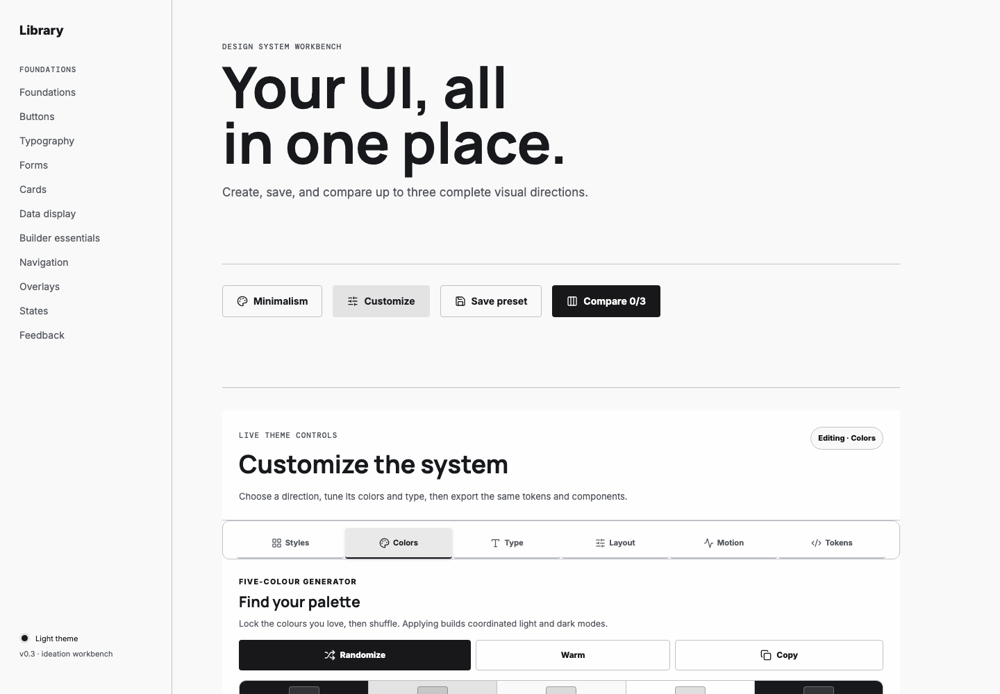
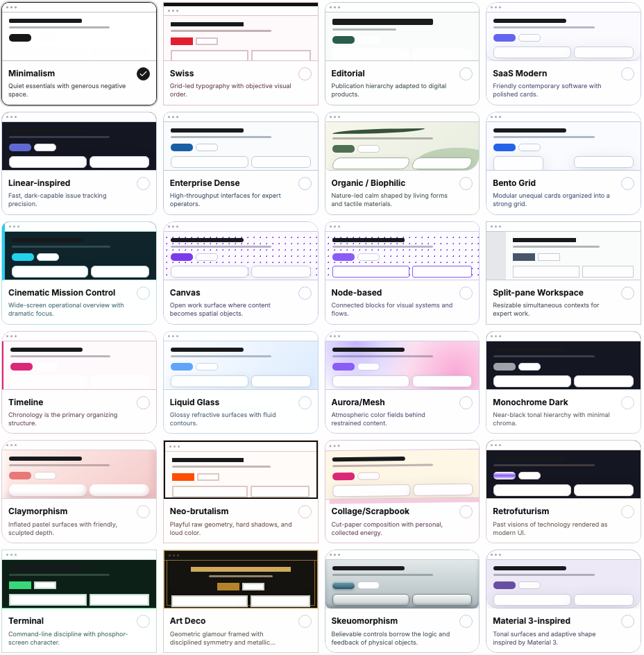
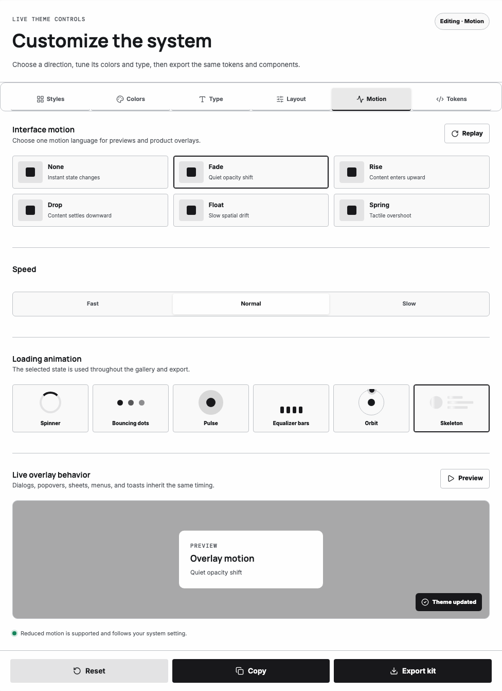
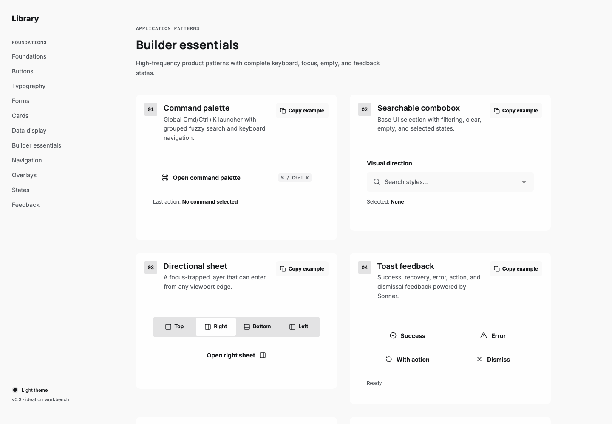

# UI Made Easy

Design a complete UI system, test it against real components, and export the result as a working TypeScript starter.

[](https://react.dev/)
[](https://www.typescriptlang.org/)
[](https://vite.dev/)
[](https://tailwindcss.com/)
[](LICENSE)



UI Made Easy is a desktop-first design-system workbench. It keeps the theme controls and the full component inventory on one page, so a color, type, spacing, surface, or motion decision can be judged as part of a system—not against one polished card.

No account or backend is required. Themes and saved comparisons live in browser storage, and the final result leaves the browser as source code.

## What v0.3 includes

- **24 authentic presets** with distinct composition, typography, geometry, surfaces, interaction treatment, and Style DNA.
- **One coordinated editor** for styles, palettes, typography, layout, motion, and semantic tokens.
- **Six motion recipes**, three speed settings, and six loading treatments with live previews.
- **Eight builder essentials** for the product patterns most projects need after basic buttons and cards.
- **Schema-v3 themes** with validated light/dark palettes and migration from earlier saved themes and retired preset names.
- **Named saved variants** with edit, duplicate, remove, and side-by-side comparison for up to three directions.
- **One-click TypeScript ZIP export** containing a runnable Vite, React, Tailwind CSS v4, and shadcn-compatible foundation.

## How to use it

1. **Choose a style.** Open the **Styles** tab in the first section and select one of the 24 visual directions. Preset changes are undoable.
2. **Build a palette.** In **Colors**, generate five coordinated colors, lock the ones worth keeping, edit hex values, review contrast, and apply them to the semantic light and dark roles.
3. **Tune the system.** Use **Type** for font pairing, scale, weight, and tracking; use **Layout** for spacing, density, width, radii, borders, shadows, and surface treatment.
4. **Choose the behavior.** Use **Motion** to preview the interface recipe, timing, overlays, and loading treatment together.
5. **Inspect the inventory.** Scroll through foundations, forms, cards, tables, navigation, overlays, feedback, loading states, and application patterns. Every section consumes the same active tokens.
6. **Save and compare.** Name up to three variants, then compare the same representative interface side by side. Any variant can be edited or duplicated.
7. **Export the foundation.** Click **Export Tailwind starter kit** to download the selected style, tokens, components, and setup instructions as a TypeScript project.

## 24 authentic visual directions

Every active preset carries a reference basis, required signatures, intended uses, accessibility adaptations, and a list of shortcuts to avoid. Layout-led styles use real structural demos; named product and design-system references are clearly labeled as inspired interpretations rather than official implementations.

| Category | Presets |
| --- | --- |
| Product | Minimalism, Swiss, Editorial, SaaS Modern, Linear-inspired, Enterprise Dense, Organic / Biophilic |
| Layout | Bento Grid, Cinematic Mission Control, Canvas, Node-based, Split-pane Workspace, Timeline |
| Effects & dark | Liquid Glass, Aurora/Mesh, Monochrome Dark, Claymorphism |
| Expressive & era | Neo-brutalism, Collage/Scrapbook, Retrofuturism, Terminal, Art Deco, Skeuomorphism |
| System reference | Material 3-inspired |



Retired definitions remain available only as migration source material. They do not appear in the active catalog and do not inflate the preset count.

## Motion and loading playground

Motion is a theme token, not a collection of one-off component animations. Select **None**, **Fade**, **Rise**, **Drop**, **Float**, or **Spring**, then resolve it at **Fast**, **Normal**, or **Slow** speed. Dialogs, popovers, sheets, menus, toasts, previews, and the exported starter share the resulting duration, easing, distance, scale, and overlay behavior.

Loading states can use **Spinner**, **Bouncing dots**, **Pulse**, **Equalizer bars**, **Orbit**, or **Skeleton**. The playground supports pause/replay, identifies the active theme loader, and follows the system reduced-motion preference.



## Eight builder essentials

The workbench includes higher-level, keyboard-aware application patterns alongside its core UI primitives:

| Pattern | Included behavior |
| --- | --- |
| Command palette | Cmd/Ctrl+K launcher, grouped fuzzy search, shortcuts, and keyboard navigation |
| Searchable combobox | Filtering, selection, clear, and empty states |
| Directional sheet | Focus-trapped layer that opens from any viewport edge |
| Toast feedback | Success, recovery, error, action, and dismissal states |
| Calendar date picker | Keyboard-operable date selection and clear state |
| Single and range sliders | Pointer and keyboard input with values, steps, and labels |
| File dropzone | Browse/drop input, validation, status announcements, and removal |
| Data table tools | TanStack sorting, filtering, selection, page sizing, and pagination |

Each pattern is registered once, rendered in the gallery, included in export, and paired with a copyable usage example.



## Theme schema and persistence

`ThemeConfig` v3 is the contract shared by the workbench, saved variants, comparisons, CSS generation, and project export. It stores:

- Complete semantic light and dark palettes, including foreground, border, status, and focus roles.
- Heading and body font families, type scale, weights, and tracking.
- Density, base spacing, content width, control/surface radii, border width, shadow, and surface treatment.
- Motion recipe, speed, and loading treatment.

Themes are validated before they are saved or exported. The loader migrates v1/v2 theme records to v3, maps legacy and retired preset names to a current direction, supplies new fields from the closest preset recipe, and enforces accessible foreground and focus colors. Saved comparison records run through the same migration path.

## Save and compare directions

Save a theme under a meaningful name, switch directions, and repeat. The comparison workspace renders the same dashboard, form, table, status, and feedback sample for up to three variants, making typography, density, palette, and component treatment easy to judge without relying on memory.

Saved variants can be renamed, updated, duplicated, or removed. Their full schema-v3 configuration and preferred light/dark preview mode are stored locally.

## Export a working TypeScript starter

The export button creates a ZIP that can be installed and run immediately. It includes:

- Vite, React, strict TypeScript, and Tailwind CSS v4 setup.
- Semantic light/dark CSS variables, font loading, motion variables, and reduced-motion rules.
- The selected preset's authentic composition, surface effects, and structural recipe.
- A reusable `ComponentShowcase.tsx` and the eight registered builder essentials.
- Local shadcn-style primitives, `components.json`, and the `@/*` import alias.
- `theme-manifest.json` with the schema, dependencies, recipe, and authenticity notes.
- A generated README with setup steps and the exact selected theme settings.

After downloading:

```bash
mkdir ui-starter
unzip minimalism-theme-ui-starter.zip -d ui-starter
cd ui-starter
npm install
npm run dev
```

Edit `src/components/ComponentShowcase.tsx` to turn the foundation into a product page, or reuse the primitives and semantic CSS in an existing project.

## Local setup

```bash
git clone https://github.com/obro79/ui-made-easy.git
cd ui-made-easy
npm install
npm run dev
```

Open the URL printed by Vite. Node.js 22 matches the CI environment.

## Architecture

The codebase is token-first and registry-driven. Each domain has one source of truth, and the editor, gallery, comparison view, persistence, and exporter consume those contracts instead of maintaining parallel lists.

```text
src/
├── components/ui/                 Reusable UI primitives
├── components/builder/            Eight application-level patterns
├── components/ThemeCustomizer.tsx Six-panel inline workbench
├── components/ComparisonWorkspace.tsx
├── component-registry.tsx         Builder previews, source files, and export metadata
├── presets.ts                     Canonical preset registry and legacy mappings
├── style-dna.ts                   Authenticity and visual-recipe contracts
├── theme.ts                       Schema-v3 tokens, CSS variables, validation, migration
├── motion.ts                      Motion recipes and speed resolution
├── variants.ts                    Saved comparison persistence and migration
├── export-project.ts              Standalone TypeScript ZIP generation
├── authentic-styles.css           Shared structural recipe primitives
└── curated-styles.css             High-signal treatments for the active 24
```

The style registry drives selector cards, the live page, Style DNA, comparisons, migration, and export. The component registry drives the builder gallery, copyable examples, dependencies, and exported source. The motion registry drives controls, overlays, loading behavior, and generated CSS.

## Quality commands

```bash
npm run typecheck           # TypeScript project validation
npm run test                # Unit tests plus style/catalog contracts
npm run test:unit           # Unit suite only
npm run test:styles         # Preset count, migration, token, and CSS contracts
npm run test:e2e            # Chromium interaction and accessibility checks
npm run test:visual         # Desktop visual-regression suite
npm run test:visual:update  # Intentionally update visual baselines
npm run test:export         # Generate and compile the exported starter
npm run build               # Type-check and create a production build
npm run preview             # Preview the production build
```

## Accessibility

Every visual direction keeps semantic controls, visible keyboard focus, readable text, contrast-aware palettes, and reduced-motion support. Authenticity can change composition and treatment; it cannot remove those guardrails.

## License

[MIT](LICENSE)
