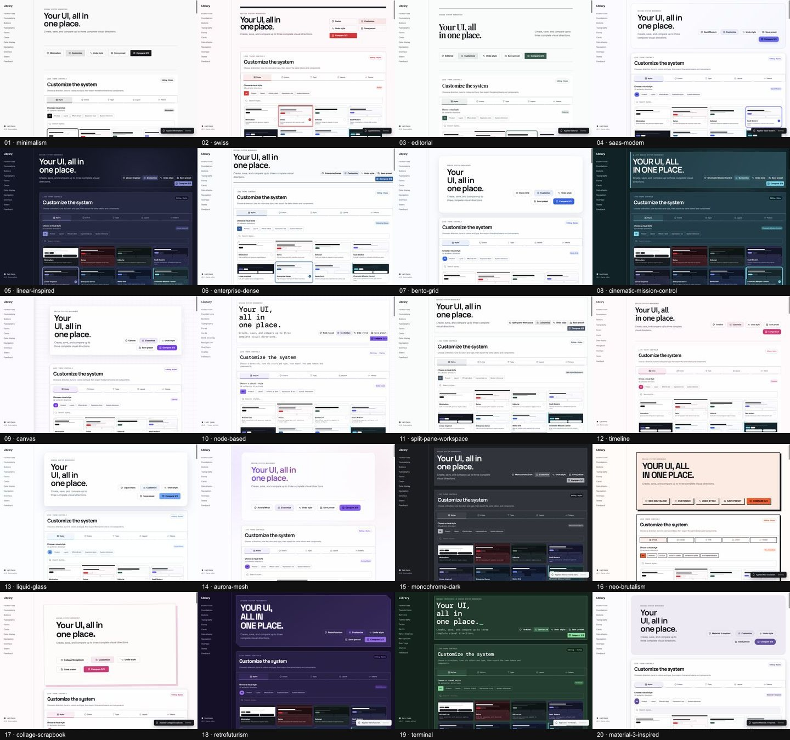
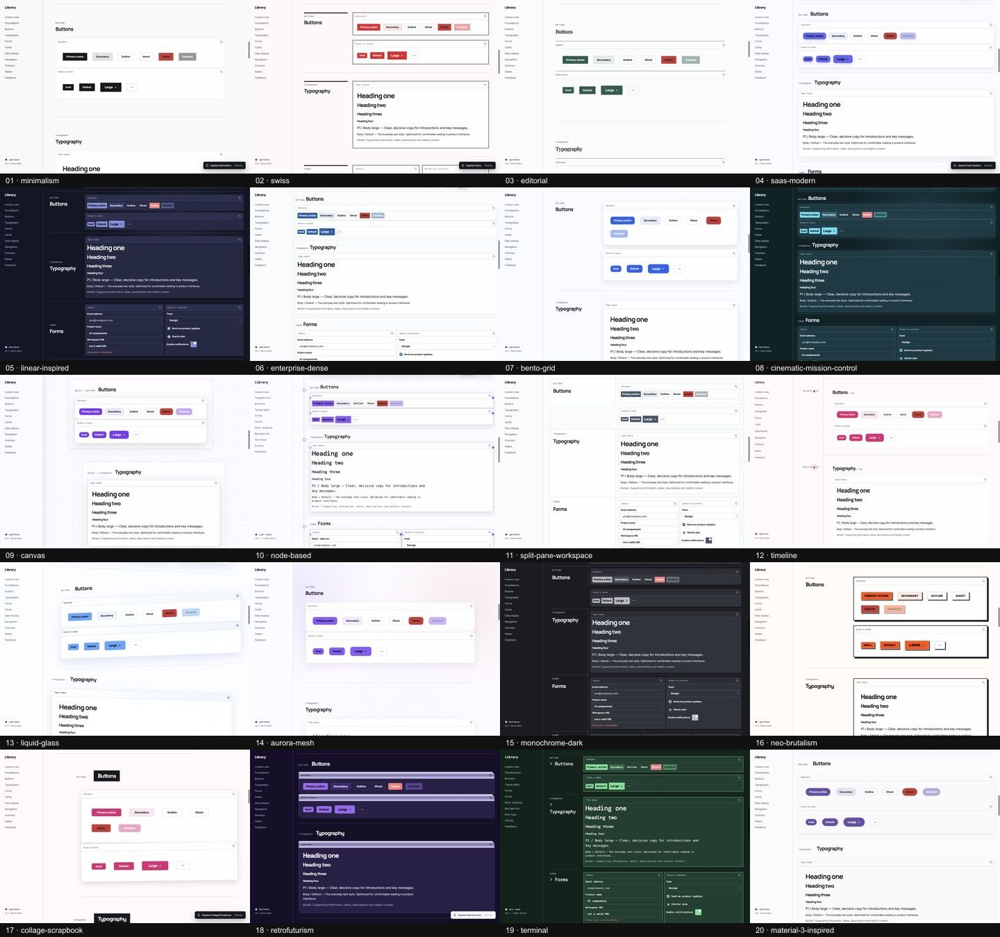
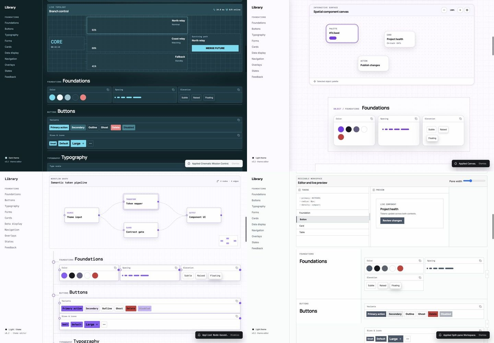
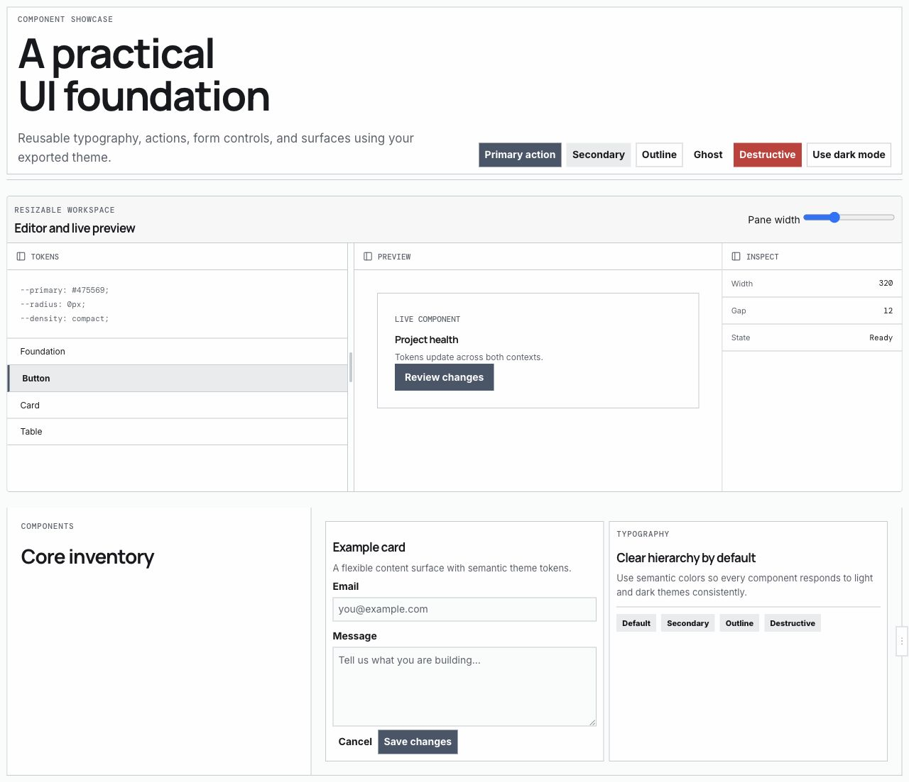

# Desktop QA report — 2026-07-19

## Result

The 20-preset desktop workbench passed the final visual, interaction, accessibility, persistence, and export checks. The review covered every selectable preset in both light and dark modes, with a separate human review of the top-level composition and the core component inventory.

## Visual review

### Complete preset overview

### Core component consistency

### Interactive structural recipes

### Independently compiled export

## Automated browser matrix

The final matrix exercised 20 presets in both supported modes: 40 rendered theme states total.

| Check | Acceptance bar | Result |
| --- | --- | --- |
| Horizontal overflow | 0 px at 1440 px desktop viewport | Passed 40/40 |
| Primary action contrast | At least 4.5:1 | Passed 40/40 |
| Destructive action contrast | At least 4.5:1 | Passed 40/40 |
| Focus indicator contrast | At least 3:1 | Passed 40/40 |
| Button geometry | Small < default < large | Passed 40/40 |
| Button treatments | At least four distinct enabled variants | Passed 40/40 |
| Content alignment | 248 px rail; gallery begins after rail | Passed 40/40 |
| Specimen balance | Paired specimens have equal widths | Passed 40/40 |
| Structural recipe presence | Exactly the four applicable presets | Passed 40/40 |

## Interaction coverage

- Verified every main button specimen produces visible feedback.
- Verified card actions and all three table-row menus produce visible feedback.
- Verified dropdown Arrow navigation, Escape dismissal, outside-click dismissal, and focus return.
- Verified tabs, accordion sections, pagination links, popover controls, Dialog, and Alert Dialog.
- Verified modal centering, full-viewport overlays, scroll locking, focus traps, Escape, and trigger focus restoration.
- Verified the six loading treatments, pause/play state, and reduced-motion rules.
- Verified the five-colour palette generator, locks, randomization, warm example, editable hex values, contrast summary, apply, and reset.
- Verified font selection, roving keyboard focus, density propagation, content-width controls, spacing, radius, border, shadow, and mode controls.
- Verified named preset creation, update, **Save as new**, three-way comparison, duplication, removal, mixed light/dark previews, and storage migration.
- Verified Canvas keyboard pan/zoom and selection, Node relationships and selection, Split-pane keyboard resizing and review state, and Mission Control branch selection and merge state.

## Export verification

The generated Split-pane Workspace ZIP was unpacked into a clean temporary directory and tested independently.

- `npm install`: passed, 0 vulnerabilities.
- `npm run build`: passed (`tsc --noEmit && vite build`).
- Generated Vite + React + Tailwind v4 page: no horizontal overflow at 1280 px.
- Light/dark token parity: no differences across the compared role tokens.
- Structural Split-pane demo: rendered in the export and passed resize/review interaction checks.
- The exported inspector remains inside its grid and no longer inherits the workbench navigation rail.

## Repository checks

- `npm run test:styles`: passed with exactly 20 curated presets and 20 migration aliases.
- `npm run build`: passed with the ZIP library split into a lazy-loaded chunk.
- TypeScript: passed as part of the production build.
- Final React review covered hook cleanup, stable callbacks, native button behavior, modal focus containment, and semantic form/table markup.

## Scope note

This pass prioritized desktop per the product decision for this slice. Responsive guard rules remain in the stylesheet and validator, but a full mobile visual-regression review is intentionally deferred.
